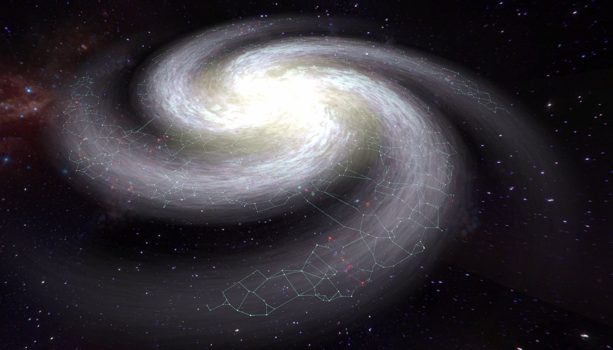
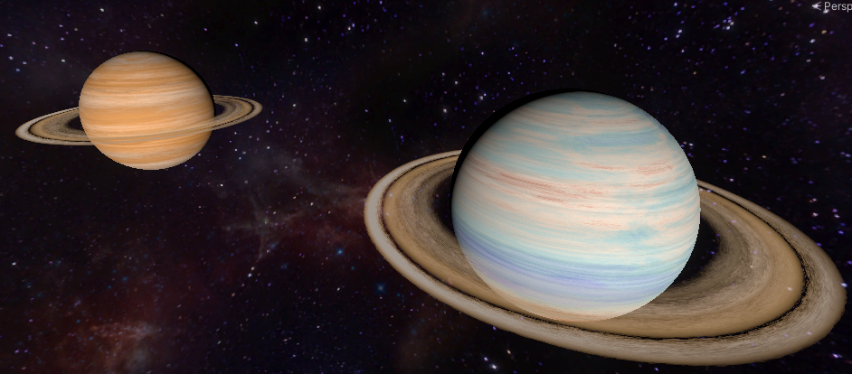
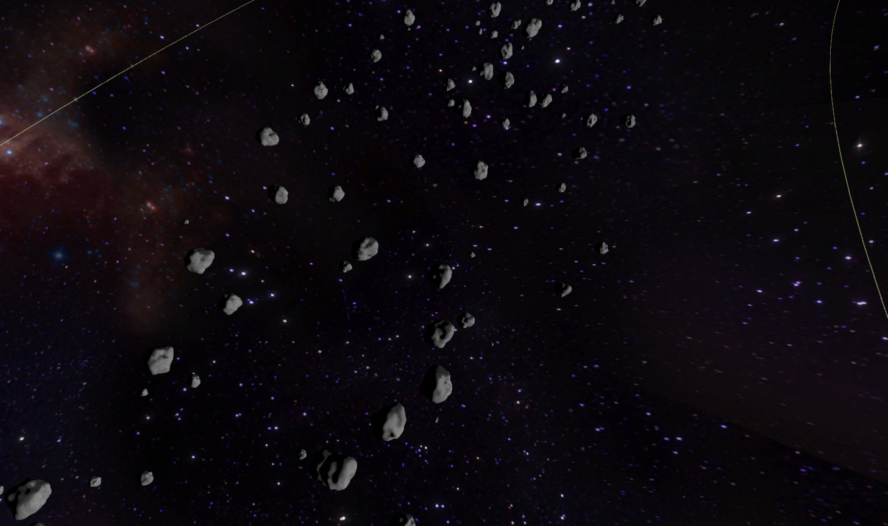

# Space-Simulator
A space simulator with procedural planets

# Installation
For the moment, this project is only available as a plain unity project.
You can download a Unity editor to load it
Editor version : 2021.3.33f1

# Features

The Galaxy Generator creates between 250 and 5000 unique stars system to populate a procedurally-generated galaxy.

Each individual star system is fully populated with procedural planets.
The orbits are pseudo-realistic, I calculated orbits based on each planet mass and spin, but I'm no astrophysicist.

Each planet texture is based on a procedurally generated heightmap, then colored base on the temperature of the planet and water level.

Other structures can be generated, such as nebulaes :

Black Holes :

Niven Rings :

